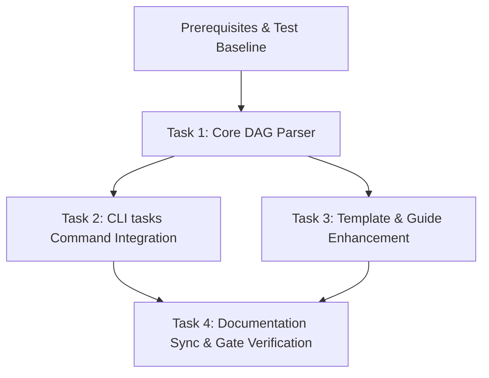

# Preparation

## Parallel Execution Strategy

- **Sequential Baseline**: Baseline test suite run.
- **Parallel Slices**: Core parser implementation, CLI command hookup, and artifact templates upgrade.
- **Convergence & Verification**: Unit test execution, documentation build, and gate checks.

- [x] Baseline test suite run and verified green.

# Tasks

## Task 1: Core Markdown DAG Parser
- **Builds**: `parse_tasks_markdown` and `get_change_tasks_dag` in `cabbage_cli/core.py`
- **Blocked By**: Preparation
- **Parallel Group**: Phase 1
- **Verification**: `python3 -m unittest tests/test_tasks_dag.py`
- **Standard Operating Procedure (Task SOP)**:
  1. *[RED]* Define failing unit tests in `tests/test_tasks_dag.py`.
  2. *[GREEN]* Implement robust regex-based parser extracting Mermaid, Tasks, SOP, and Checkboxes.
  3. *[REFACTOR]* Refactor SOP regex to cleanly distinguish task checkboxes from SOP items.
  4. *[VERIFY]* Assert parser unit test suite passes cleanly.
- [x] Implement `parse_tasks_markdown` with DAG dependency resolution.
- [x] Implement subagent dispatch plan generator with SOP prompts.

## Task 2: CLI tasks Command Integration
- **Builds**: `cabbage tasks` command with `--export-dag` and `--json` in `cabbage_cli/cli.py`
- **Blocked By**: Task 1
- **Parallel Group**: Phase 2
- **Verification**: `python3 -m cabbage_cli tasks agent-workflow-dag-and-grill`
- **Standard Operating Procedure (Task SOP)**:
  1. *[RED]* Define CLI execution failure test for missing command.
  2. *[GREEN]* Implement `cmd_tasks` and wire into argparse subparser.
  3. *[REFACTOR]* Polish terminal dashboard output and ANSI-free status tags.
  4. *[VERIFY]* Verify formatted output, `--export-dag`, and `--json`.
- [x] Bind `tasks` command in `cli.py`.
- [x] Synchronize vendored CLI files under `.cabbage/tooling/cabbage_cli/`.

## Task 3: Template & Specification Enhancement
- **Builds**: PRD, Tech-Spec, and Tasks templates updated with Grill-Me, Decision Boundaries, and Task SOP
- **Blocked By**: Task 1
- **Parallel Group**: Phase 2
- **Verification**: `python3 -m unittest tests/test_templates.py`
- **Standard Operating Procedure (Task SOP)**:
  1. *[RED]* Identify missing sections in template structure tests.
  2. *[GREEN]* Update `prd.md`, `tech-spec.md`, and `tasks.md` in `cabbage_cli/assets/templates/`.
  3. *[REFACTOR]* Ensure strict compliance with template heading contracts.
  4. *[VERIFY]* Assert template test suite passes cleanly.
- [x] Update templates with Grill-Me, Decision Boundaries, and Task SOP.
- [x] Update `SKILL.md` and reference documentation.

## Task 4: Documentation Sync & Gate Verification
- **Builds**: End-to-end documentation synchronization and gate validation
- **Blocked By**: Task 2, Task 3
- **Parallel Group**: Phase 3
- **Verification**: `python3 -m cabbage_cli validate agent-workflow-dag-and-grill`
- **Standard Operating Procedure (Task SOP)**:
  1. *[RED]* Check missing current-state documents in `docs/`.
  2. *[GREEN]* Execute `cabbage sync` to extract specifications into `docs/`.
  3. *[REFACTOR]* Verify clean relative links and headings.
  4. *[VERIFY]* Run `cabbage gate agent-workflow-dag-and-grill merge`.
- [x] Add or update automated regression tests
- [x] Update affected current-state documentation under docs/

# Verification

- [x] Run full test suite `python3 -m unittest discover tests`.
- [x] Verify `cabbage gate agent-workflow-dag-and-grill merge` passes cleanly.
