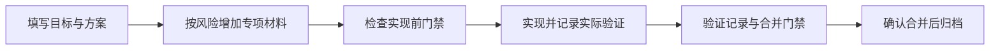

## 工作流全景

```mermaid
flowchart LR
    Change[填写目标与方案] --> Risk[按风险增加专项材料]
    Risk --> Gate[检查实现前门禁]
    Gate --> Implement[实现并记录实际验证]
    Implement --> CI[验证记录与合并门禁]
    CI --> Archive[确认合并后归档]
```
