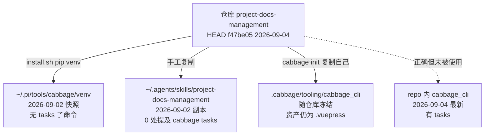
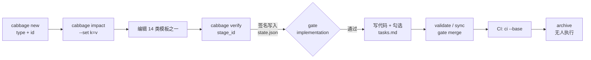

# Cabbage 运行链路与复杂度审计报告

审计对象：`/home/devcxl/Projects/project-docs-management`（HEAD `f47be05`，2026-09-04）
审计范围：本仓库自举链路 + 4 个真实消费项目（LaseAI / fcitx5-voice-input / trading-web3-ai / cabbage-bot）
审计方式：只读检查 + `/tmp/cabbage-consumer` 隔离复现
基线假设：执行者智能水平按 **deepseek-v4-flash** 量级评估（低推理预算、弱自我纠错）

---

## 0. 摘要

| 结论 | 内容 |
|---|---|
| 链路现状 | 存在 **3 套并存的分发/执行路径**（全局安装、skill 副本、`.cabbage/tooling` 内置），三者版本互不一致 |
| 最致命的缺陷 | `cabbage init` 生成的 CI 模板在**任何非本仓库项目里第一次运行就失败** |
| 第二个致命缺陷 | 文档（SKILL.md / cli.md / lifecycle.md）里的 `verify` 参数 **6 处写法错误**，照做必报错 |
| 第三个致命缺陷 | `sync` 无状态校验，**未验证的占位符文档可以直接写进 `docs/`** |
| 复杂度主因 | 同一个概念有 **2~3 个名字**（stage id / artifact 名 / 文件名），且概念总量约 **150 个离散事实** |
| 面向弱模型的核心判断 | 当前设计假设执行者"会自己读第二个文件推断语义"，这恰好是 flash 级模型最缺的能力 |

---

## 1. 运行链路实况

### 1.1 三条并存路径（版本已漂移）



实测哈希（前三段为文件 sha256 前 12 位）：

| 来源 | cli.py | core.py | scaffold.py | `tasks` 子命令 | docs-site 资产 |
|---|---|---|---|---|---|
| 仓库根（最新） | `364662dced68` | `27d42f73aca0` | `a9af385772f5` | 有 | `.vitepress` |
| `.cabbage/tooling`（本仓库） | `364662dced68` | `27d42f73aca0` | `72cc5f484272` | 有 | **`.vuepress`（旧）** |
| 全局安装（实际执行） | `4d0b541297b0` | `ddcf06bde3f9` | `a9af385772f5` | **无** | `.vitepress` |

```bash
# 复现
cabbage tasks --help
# cabbage: error: argument cmd: invalid choice: 'tasks'
#   (choose from 'init','adopt','doctor','new','discard','status','next',
#    'impact','validate','verify','sync','gate','archive','ci','docs')

python -m cabbage_cli tasks --help   # 正常
```

结论：**仓库 9/4 新增的 tasks DAG / grill SOP 流程，在本机实际运行时全部不可用。**
`cabbage doctor` 不检查版本一致性，漂移对使用者不可见。

### 1.2 变更环路



真值源：
- `.cabbage/config.yaml` → `impact_fields`(10) / `ci.current_state_rules`(10 条)
- `.cabbage/workflows/*.yaml` → 8 个 workflow，feature 有 10 个阶段
- `.cabbage/changes/<id>/{change.yaml,state.json,*.md}`

签名算法（`core.py:142-176`）：

```
signature(stage) = sha256(
    workflow_file_hash          ← 整个 yaml 文件
  + {type}
  + stage_definition            ← 整段 stage dict
  + artifact_file_hash
  + {dep: signature(dep)}       ← 递归
)
```

### 1.3 真实消费项目现状

| 项目 | change 记录 | archive | vendored CLI | CI 模板 |
|---|---|---|---|---|
| LaseAI | 0 active | 1（`adopt-existing-docs`） | 9/2 快照 | 与模板**完全相同** → 必失败 |
| fcitx5-voice-input | 0 active | 2 | 9/2 快照 | 已人工改（删测试步骤、补 PYTHONPATH） |
| trading-web3-ai | 0 active | 0 | 9/2 快照 | 已全面人工重写 |
| cabbage-bot | 0 active | 0 | 9/2 快照 | 与模板相同 → 必失败 |

**4 个项目中 2 个的 CI 是坏的，另外 2 个被人工改过 —— 模板 0% 开箱可用率。**

本项目自身：3 个 change 全部 `done` + 已 sync，但 `.cabbage/archive/` **为空**，最早的可追溯到 8/29。

---

## 2. 复杂度预算：一个模型要记住多少东西

### 2.1 量化

| 维度 | 数量 | 备注 |
|---|---|---|
| change 类型 | 8 | 每个的 stage 集合都不同（3~10 个） |
| 阶段（stage）总数 | 20 个唯一 id | feature 单独就有 10 个 |
| impact 字段 | 10 | 只有 5 个接了 `when` 条件 |
| 阶段状态 | 4 | pending / skipped / done / stale |
| gate 目标 | 3 | implementation / merge / archive |
| CLI 子命令 | 16 | 外加 10 个 flag |
| 模板 | 14 | 共 **68 个必填 heading** |
| reference 文档 | 13 篇 / 1125 行 | 加上 SKILL.md 408 行 = 1533 行说明 |
| 文档分类目录 | 22 | sync 只写其中 11 个 |
| 可识别 Mermaid 类型 | 18 | `core.py:236-241` |
| Markdown 格式契约 | 6 套 | frontmatter×2 / checkbox / Task 块 6 字段 / impact 表 / DAG |
| **合计离散事实** | **≈150** | 完成一次 feature 变更需要同时满足 |

### 2.2 命名分裂：同一个概念 2~3 个名字

`feature.yaml` 实测：

| stage id（CLI 唯一接受） | artifact / 文件名 | 文档里写的是 | 一致 |
|---|---|---|---|
| `requirement` | `prd.md` | `prd` | ✗ |
| `design` | `tech-spec.md` | `tech-spec` | ✗ |
| `tests` | `test-plan.md` | `test-plan` | ✗ |
| `implementation` | `tasks.md` | `tasks` | ✗ |
| `impact` | `impact.md` | — | ✓ |
| `adr` / `api` / `database` / `security` / `release` | 同名 | — | ✓ |

**10 个阶段里 4 个名字不一致。** 这是一个纯粹自找的认知负担，删除它零成本。

### 2.3 deepseek-v4-flash 量级的行为特征 → 对应触发的缺陷

| 弱模型特征 | 本设计中触发的问题 |
|---|---|
| 不会主动读第二个文件推断语义 | 不知道 stage id，只会照抄文档里的 `prd`/`tasks` → 必报错（§3 P0-3） |
| 照抄文档而非质疑文档 | SKILL.md 的错误参数被 100% 复现 |
| 倾向轻度改写模板而非清空重写 | 占位符检测靠精确字符串匹配（`LEGACY_PLACEHOLDERS`）→ 改写后的空话直接过关（§3 P1-7） |
| 遇到模糊错误优先重试/绕过 | `BLOCKED: staleness` 不告诉它"哪个上游变了" → 会去改 `state.json` 或改 workflow |
| 不会自行维护隐含不变量 | `sync` 无门禁、归档无强制、CI 模板硬编码假设 |
| 上下文只能稳定持有 ≤7 个并列概念 | 150 个事实 / 68 个必填 heading / 13 篇 reference |

---

## 3. 设计缺陷清单

### P0-1 `cabbage init` 生成的 CI 模板在所有消费项目第一次运行即失败

证据：

```bash
# 隔离复现
rm -rf /tmp/cabbage-consumer && mkdir -p /tmp/cabbage-consumer && cd /tmp/cabbage-consumer
git init -q . && touch app.py && git add -A && git -c user.email=a@b -c user.name=c commit -qm init
PYTHONPATH=<repo> python3 -m cabbage_cli init

cd /tmp/cabbage-consumer
python3 -m pip install -r requirements.txt   # rc=1  ← 无 requirements.txt
python3 -m unittest discover tests           # rc=1  ← 无 tests/ 目录
python3 -m cabbage_cli validate --all        # rc=1  ← No module named cabbage_cli
```

根因：
- 模板 `cabbage_cli/assets/integrations/cabbage.yml` 与本仓库自身 CI **逐字节相同**，被 `scaffold.py:104-106` 原样复制给消费者。
- 写死了"仓库自身"假设：`requirements.txt`、`tests/`、仓库根可导入 `cabbage_cli`。
- 第 47-57 行 `export PYTHONPATH=.cabbage/tooling` 只作用于**单个 step**，第 49 行的 `validate` 享受不到。

次要问题：无 `docs/` 时 `pnpm install --frozen-lockfile` 在 `working-directory: docs` 下会失败；`--no-vendor-cli` 模式下整条链路无 CLI 可用。

### P0-2 `sync` 不校验阶段状态，占位符内容可直接进 `docs/`

证据：

```bash
cd /tmp/cabbage-consumer
PYTHONPATH=<repo> python3 -m cabbage_cli new feature demo
PYTHONPATH=<repo> python3 -m cabbage_cli status demo      # 全部 pending
PYTHONPATH=<repo> python3 -m cabbage_cli sync demo        # 成功
# synced 3 document(s): docs/01-product/demo.md, docs/03-architecture/system-design/demo.md, docs/08-testing/demo.md

head -8 docs/01-product/demo.md
# <!-- Replace every marked prompt before verifying this stage. Use N/A with a reason when a section does not apply. -->
```

`core.py:352-379` 无任何 `stage_statuses` 判断。下游影响：
- CI 的 `require_current_state_docs`（`core.py:451-456`）只检查"改动落在 `docs/` 前缀"，不校验 docs 内容是否源自已验证 artifact。
- 文档与规范的漂移**永久不可检测**。所有 4 个真实项目都处于这个状态。

### P0-3 文档与 CLI 的阶段标识不一致，照文档执行必失败

```bash
python -m cabbage_cli verify tasks-export-dag-versioned prd
# cabbage: unknown stage: prd        rc=2
python -m cabbage_cli verify tasks-export-dag-versioned database-design
# cabbage: unknown stage: database-design   rc=2
```

错误命令分布：

| 文件 | 行号 | 错误写法 | 正确写法 |
|---|---|---|---|
| `SKILL.md` | 129 | `verify <id> prd` | `requirement` |
| `SKILL.md` | 132 | `verify <id> tech-spec` | `design` |
| `SKILL.md` | 135, 181, 292 | `verify <id> tasks` | `implementation` |
| `SKILL.md` | 182 | `verify <id> test-plan` | `tests` |
| `SKILL.md` | 183 | `verify <id> release-plan` | `release` |
| `SKILL.md` | 258 | `verify <id> tech-spec` | `design` |
| `SKILL.md` | 314 | `verify <id> database-design` | `database` |
| `references/cli.md` | 133-134 | `verify <id> prd` / `tasks` | 同上 |
| `references/lifecycle.md` | 54-56, 80 | 用 `prd`/`tech-spec`/`tasks` 描述阶段 | 同上 |

CLI 侧也没有纠错提示（只报 `unknown stage`，不提示 `did you mean: requirement`）。

### P0-4 本机运行的 skill 与 CLI 落后仓库 HEAD 两个提交

见 §1.1。附带影响：本仓库 `.cabbage/tooling` 里的 `scaffold.py` 与根不一致，`docs-site` 资产仍是 `.vuepress`（VitePress 时代之前）—— 说明 vendored 副本从未被升级路径更新过。

### P1-5 vendored tooling 生命周期混乱

- `init --force` 同时覆盖 `config.yaml` 与 `workflows/`（会丢自定义），却**不更新** `.github/workflows/cabbage.yml` 和 `docs-site`。
- 升级路径唯一，且带破坏性；没有 `cabbage self-update` 或版本标记文件。
- `.cabbage/tooling/cabbage_cli` 被当作源码目录复制（含 assets），无版本号、无校验，消费者无法判断自己装的是哪个版本。

### P1-6 impact 字段 / workflow 条件 / CI 规则三者不闭合

- config 定义 10 个 `impact_fields`；workflow 里只有 **5 个** `when` 条件（api / database / security / deployment / architecture）。
- `operations` / `data` / `performance` 置 `true` 后，CI 要求 `docs/13-operations/`、`docs/04-data/`、`docs/14-performance/` 有改动（`config.yaml` current_state_rules），但**没有任何阶段会生成这些文档，`sync` 也不会写这些目标**（`DEFAULT_STAGE_DOCS_MAPPING` 只有 11 项且不含这三者）→ 规则由工具自身无法满足。
- `condition_enabled`（`core.py:127-134`）对未知字段静默返回 `False`；拼错 `when: impact.architecure` 会导致阶段**静默跳过**，无任何 schema 校验。

### P1-7 占位符检测依赖精确字符串匹配

`LEGACY_PLACEHOLDERS`（35 条硬编码英文句子）+ `<!-- CABBAGE:` 正则。flash 级模型会**改写模板原文**而非删除，改写后的空话（"待补充"、"TBD later"、中文空话）全部通过。反向误伤也存在：任何正文出现 `TODO` 单词即报错（LaseAI 的历史 ADR 因引用代码里的 `TODO stub` 而属于此类）。

### P1-8 workflow 文件参与签名 → 一次 workflow 编辑让全部 active change 失效

`core.py:159` 把整个 workflow yaml 的哈希放进签名。任何 workflow 调整（含 `init --force`）立即让所有 change 的所有阶段变 `stale`。无迁移、无宽限、无批量重签工具。

### P1-9 归档无任何强制

`status` / `gate` / `ci` 都不检查"已合并未归档"。本仓库 3 个 change 全部 done 且已 sync，`.cabbage/archive/` 为空，最早的已挂 13 天。归档只存在于 SOP 文字中。

### P1-10 文档自相矛盾

| 位置 | 写法 | 实际 |
|---|---|---|
| `references/lifecycle.md:67` | `database-design.md -> docs/04-data/database-design/` | `docs/04-data/<change_id>.md` |
| `references/lifecycle.md` 阶段名 | `prd`/`tech-spec`/`tasks` | `requirement`/`design`/`implementation` |
| `references/enforcement.md:50-58` | 裸 `cabbage ci` | 生成的 CI 用 `python -m cabbage_cli` |
| `README.md` | curl 安装 | SKILL.md 完全不提安装 |

三套调用模型（全局 `cabbage` / `python -m cabbage_cli` / vendored）并存，没有一处说明该用哪个。

### P2 级

| # | 问题 | 位置 |
|---|---|---|
| P2-1 | `sync` 非幂等：每次重写 `synced_at` 时间戳 → 无意义 diff 噪声 | `core.py:352-379` |
| P2-2 | `sync` 直接覆盖 `docs/` 里的人工修改，无冲突检测、无备份 | 同上 |
| P2-3 | 新 init 只建 22 个空目录（仅 `docs/README.md`），但 nav/sidebar 指向 `/00-overview/` `/01-product/` 等 → 首次 `docs build` 前全部 404 | `scaffold.py:100-101` |
| P2-4 | `validate --all` 用 `verification=False`，与文档"全量校验占位符/未勾选"语义不符 | `core.py:382` |
| P2-5 | `gate` 只覆盖"出现在 git diff 里的 change"，未出现在 diff 的变更绕过全部检查 | `core.py:431-458` |
| P2-6 | 多 PR 变更下 `require_current_state_docs` 要求每个含代码 PR 都动 `docs/` → 需重复 sync 制造噪声 | `config.yaml` |
| P2-7 | tasks DAG 用正则启发式解析，Task 标题或 `Blocked By` 稍不规范即静默误判 ready/blocked | `core.py:460-560` |
| P2-8 | `verify implementation` 把 `[-]` 和 `[/]` 视为已完成 | `core.py:281` |
| P2-9 | `git_changed_files` 用 `base...HEAD` 三点 diff，与 CI 的 `origin/<base_ref>` 组合在 fork PR 上会失败 | `core.py:404-408` |
| P2-10 | `.gitignore` 忽略 `docs/.vitepress/dist/`，但仓库里存在已构建的 dist（本地与 CI 产物混入） | `.gitignore` |

---

## 4. 精简方案（按"先删除，后优化"排序）

> 排序原则：**先删概念，再改实现**。删掉的概念永久免除维护成本；优化只是把成本降低。

### 4.1 第一批：删除（净收益最高，不写新代码）

| # | 删除对象 | 理由 | 减少的事实数 | 工时 |
|---|---|---|---|---|
| D1 | 8 个 change 类型 → **3 个**（`feature` / `bugfix` / `incident`） | `architecture`/`refactor`/`integration`/`migration`/`hotfix` 都能用 feature + impact flag 表达 | -5 类型、-8 个 workflow 文件 | 1h |
| D2 | stage id 与 artifact 名分裂 → **统一**为文件名（`prd` / `impact` / `tech-spec` / `adr` / `api-design` / `database-design` / `security-review` / `test-plan` / `tasks` / `release-plan`） | 一个概念一个名字，永久消除 §3 P0-3 类错误 | -4 组映射、-10 条文档 | 2h |
| D3 | `adr` / `api` / `database` / `security` 独立阶段 → 降为 `tech-spec` 内的**可选 heading** | feature 阶段数 10 → 6 | -4 阶段、-4 模板 | 3h |
| D4 | impact 字段 10 → **4**（`product` / `architecture` / `data` / `deployment`）；`api`/`security`/`performance`/`operations` 并入 | 只有 4 个字段有实际行为；其余是"填了反而让 CI 无法通过"的陷阱 | -6 字段、-6 条 CI 规则 | 1h |
| D5 | 13 篇 reference → **3 篇**（`OPERATING.md`：日常操作 / `REFERENCE.md`：状态与门禁 / `ADOPTION.md`：存量迁移） | 1533 行说明 → ~500 行；弱模型不再需要"先读哪一篇"的决策 | -10 文档、-1000 行 | 3h |
| D6 | 22 个文档目录 → **8 个**（`00-overview` / `01-product` / `03-architecture` / `04-data` / `05-api` / `08-testing` / `12-release` / `15-incidents`） | 空目录不产生任何价值，但让分类判断变难 | -14 目录、-14 条分类规则 | 1h |
| D7 | vendored `cabbage_cli` 副本 → 改为仅复制**入口脚本**（或彻底取消 `--no-vendor-cli` 反向） | 消除 §1.1 的三路漂移根因 | -1 份源码副本 | 2h |
| D8 | tasks DAG 的 `Parallel Group` / `subagent_dispatch_plan` / 正则解析器 | 未被真实项目使用（4 个项目 0 处调用）；正则解析静默误判 | -3 概念、-120 行代码 | 1h |
| D9 | `adopt` 的 20 条分类规则 → 退化为"列清单 + 人工归类" | 一次性命令，规则永远猜不准 | -20 条规则 | 1h |

**合计：事实数 150 → 约 45；说明文档 1533 行 → 约 500 行；工时约 15h。**

### 4.2 第二批：修复（必须做，否则弱模型必然踩）

| # | 修复 | 具体动作 | 工时 |
|---|---|---|---|
| F1 | CI 模板泛化 | 删除 `unittest`/`requirements.txt` 硬编码；首步统一 `export PYTHONPATH=.cabbage/tooling`（或写 `cabbage` wrapper）；docs 目录从 `config.yaml` 读；无 `docs/package.json` 时跳过站点构建 | 2h |
| F2 | `sync` 加门禁 | 只允许 `status == done` 的阶段同步；拒绝含残留占位符的 artifact；写入前比对目标文件哈希，冲突则报错而非覆盖 | 2h |
| F3 | 占位符检测改结构化 | 规则从"匹配 35 个英文字符串"改为：① 正文出现任何 HTML 注释即失败 ② 每个 required heading 下正文 ≥20 字符 ③ 可选保留 TODO 检测但仅限行首 | 2h |
| F4 | 签名不再包含 workflow 文件哈希 | 只哈希 artifact + 依赖 artifact 哈希；workflow 变更改由 `cabbage status` 提示"workflow 已变更，建议重验" | 1.5h |
| F5 | `unknown stage` 报错给纠错 | 列出该 change 可用 stage id 与对应文件名：`unknown stage: prd. available: requirement(prd.md), impact(impact.md), ...` | 0.5h |
| F6 | 归档提醒 | `cabbage status` 顶部输出 "3 changes merged-but-unarchived (oldest 13 days)" | 0.5h |
| F7 | workflow schema 校验 | `init` / `doctor` / `validate` 时检查：`depends_on` 的 id 存在、`when` 引用存在于 `impact_fields`、`artifact` 的文件名不重复 | 2h |
| F8 | 统一 CLI 入口 | 全仓库文档只保留 `cabbage ...` 一种写法；生成 CI 用 `.cabbage/tooling/bin/cabbage` wrapper | 1h |

### 4.3 第三批：可选（收益递减）

- `sync` 去掉 `synced_at` 时间戳（P2-1）
- 新 init 生成 8 个分类目录的 `README.md` 占位（P2-3）
- `validate --all` 默认 `verification=True`（P2-4）
- 本地未跟踪 change 也纳入 `gate` 检查（P2-5）
- `current_state_docs` 规则改为"变更归档时检查一次"而非每个 PR（P2-6）

---

## 5. 目标形态（精简后）

```
变更类型:  feature | bugfix | incident           (3)
阶段:      prd → impact → tech-spec → test-plan → tasks → release-plan(可选)   (6，可省 1)
阶段名 = 文件名                                      (1 个名字)
impact:    product | architecture | data | deployment  (4)
gate:      implementation | merge                    (2)
状态:      pending | done | stale | skipped          (4，内部状态不要求用户理解)
CLI:       cabbage new/status/next/verify/gate/sync/archive/ci/docs  (9)
reference: OPERATING.md | REFERENCE.md | ADOPTION.md  (3)
docs 目录: 8 个
```

**弱模型需要记住的事实：约 45 个（当前约 150）。**
**完成一次 feature 变更的最短路径：4 条命令。**

```bash
cabbage new feature <id>
cabbage next <id>          # 明确告诉你下一步编辑哪个文件
cabbage verify <id> <artifact-文件名去掉 .md>
cabbage gate <id> merge
```

---

## 6. 修复顺序与验收标准

| 顺序 | 动作 | 验收命令 | 期望 |
|---|---|---|---|
| 1 | F1 CI 模板泛化 | 在 `/tmp/cabbage-consumer` 重新 `init` 后逐条跑模板步骤 | 全部 rc=0 |
| 2 | F2 sync 门禁 | `new` 后立即 `sync` | rc≠0，提示 "stage requirement is pending" |
| 3 | D2 + F5 统一命名 | `grep -rn "verify.*\(prd\|tech-spec\|tasks\|test-plan\)" SKILL.md references/` | 0 结果 |
| 4 | F4 签名解耦 | 修改 workflow yaml 后 `cabbage status <id>` | 阶段仍为 done，附提示 |
| 5 | F6 + F8 归档提醒与入口统一 | `cabbage status` | 顶部显示未归档数量 |
| 6 | D1/D4/D5/D6 概念删除 | `cabbage validate --all` + `cabbage ci --base HEAD~1` | PASSED |
| 7 | D3/D7/D8/D9 深度精简 | `python -m unittest discover tests` | 全部通过（需同步改测试） |

---

## 7. 一句话结论

当前设计的优雅之处（拓扑签名、条件阶段、DAG 并行）恰好是弱模型最容易踩空的地方；
**先做 D2（统一命名）和 F1（修 CI 模板）—— 两个动作加起来约 4 小时，能立刻消除 3 个 P0 中的 2 个。**

---

*报告生成时间：2026-09-11 | 复现环境：Python 3.14.7 / pnpm 11.3.0 / VitePress 1.6.4*
