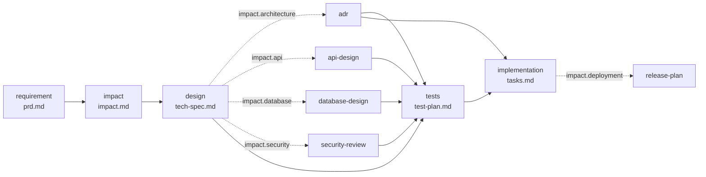
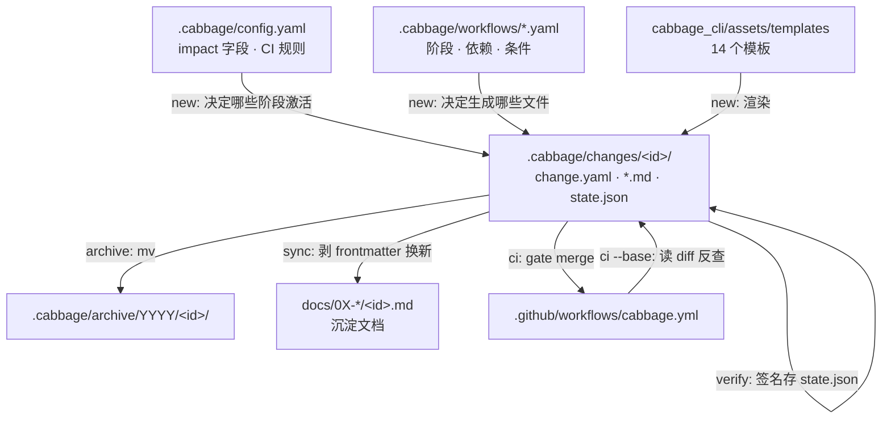

# Cabbage 运行链路文档

整理对象：`/home/devcxl/Projects/project-docs-management`（HEAD `f47be05`，2026-09-04）
配套审计：`AUDIT.md`

---

## 0. 一句话总结

`new` 生成文件 → 你填内容 → `verify` 签名 → `gate` 卡点 → `sync` 沉淀 → `archive` 归档，
全程由 `state.json` 里的签名链驱动。

---

## 1. 项目三重身份

| 身份 | 目录 | 给谁用 | 交付方式 |
|---|---|---|---|
| **产品** | `cabbage_cli/` + `assets/` | 别的项目 | pip 包 `project-docs-cabbage`，装出 `cabbage` 命令 |
| **说明书** | `SKILL.md` + `references/` | AI / 人 | 被 agent 直接读取的 SOP |
| **自举样本** | `.cabbage/` + `docs/` + `.github/` | 自己 | 自己的项目用自己的工具管 |

**这三个身份的版本各自独立。** 所有版本漂移问题的根源都在这里。

---

## 2. 目录结构

```
project-docs-management/
│
├── cabbage_cli/                        【产品本体 · Python 包 1216 行】
│   ├── cli.py          291 行  ── 16 个子命令的参数解析 + 入口
│   ├── core.py         612 行  ── 引擎：签名/校验/门禁/同步/CI/DAG
│   ├── scaffold.py     310 行  ── 脚手架：init / new / adopt / 模板渲染
│   ├── __init__.py             ── __version__ = "0.1.0"
│   └── assets/                 ── 会被复制到用户项目的资产
│       ├── workflows/   8 个   ── 工作流定义（阶段 + 依赖 + 条件）
│       ├── templates/  14 个   ── 阶段文档模板（含 {{CHANGE_ID}} 占位）
│       ├── integrations/cabbage.yml   ── CI 模板
│       └── docs-site/           ── VitePress 站点骨架（package.json + config.ts + README.md）
│
├── SKILL.md              408 行 【说明书】Agent 的 SOP + 场景分派 + 命令速查
├── references/      13 篇 1125 行【说明书】CLI / 生命周期 / 命名 / 图表 / 采纳 ...
│
├── .cabbage/                    【自举】本仓库自己的工作区
│   ├── config.yaml              ── 10 个 impact 字段 + CI 规则 + docs 目录名
│   ├── workflows/         8 个  ── 自己的副本（init 时从 assets 复制）
│   ├── changes/           4 个  ── 进行中的变更（3 个已完成未归档 + 1 个未跟踪）
│   ├── archive/                 ── 空（该归档没归档）
│   ├── tooling/cabbage_cli/     ── 冻结的 CLI 副本（9/2 快照，docs-site 还是 .vuepress）
│   └── adoption-report.md       ── adopt 命令的产物
│
├── docs/                        【自举】沉淀文档树 + VitePress 站点
│   ├── .vitepress/config.ts     ── nav / sidebar / mermaid 插件 / rewrites
│   ├── README.md                ── 首页（layout: home）
│   ├── 00-overview … 17-compliance   ── 22 个分类目录（多数是空的）
│   └── node_modules + dist      ── 站点依赖与产物
│
├── tests/                 5 个 892 行  ── 单测（32 个用例）
├── integrations/agent-contract.md      ── 让你贴进自己项目 AGENTS.md 的规则片段
├── examples/              3 个 32 行   ── 用法示例
├── packaging/aur/PKGBUILD              ── Arch 打包
├── scripts/install.sh, build-deb.sh    ── 远程安装 / deb 打包
├── .github/workflows/                  ── 自己的 CI（== assets 里那份，逐字节相同）
├── pyproject.toml                      ── 包定义，入口 cabbage = cabbage_cli.cli:main
├── requirements.txt                    ── 只有一个 PyYAML
└── README.md / AUDIT.md / TEST_REPORT.md / SKILL.md / RUNTIME.md
```

---

## 3. 代码结构：3 个文件的分工

```
cli.py  ── 薄壳。每个命令一个 cmd_xxx(args) 函数，只做三件事：
          解析参数 → 调 core/scaffold → 打印结果（emit 支持 --json）
          没有任何业务逻辑。

                ↓ 调用

core.py ── 引擎。按依赖顺序分 7 层，纯函数式，不直接改盘（除 state/docs）：
  L1 基础   write_text_atomic / load_yaml / dump_yaml / sha256_file / now_iso
  L2 定位   project_root（向上找 .cabbage/config.yaml）/ change_dir / workflow / load_state
  L3 状态   condition_enabled → current_signature → stage_statuses
  L4 校验   parse_frontmatter / validate_markdown（6 类检查）/ dependency_errors
  L5 动作   verify_stage / sync_change_to_docs / validate_change / gate
  L6 CI     git_changed_files / is_code_change / ci_check
  L7 DAG    parse_tasks_markdown / get_change_tasks_dag

scaffold.py ── 脚手架。都在"创建"和"迁移"侧：
  init_project / copy_asset_tree / render_template / ensure_artifacts
  new_change / sync_impact_document / discard_change
  adopt_project / iter_adoption_docs / classify_adoption_doc / conforming_area
```

**唯一需要记的判断**：改行为去 `core.py`，改生成物去 `scaffold.py`，改参数去 `cli.py`。

---

## 4. CLI 命令总览（16 个）

| 命令 | 行号 | 作用 |
|---|---|---|
| `init` | `cli.py:14` | 一次性铺开脚手架 |
| `doctor` | `cli.py:42` | 环境诊断（Python/PyYAML/git/pnpm） |
| `adopt` | `cli.py:20` | 盘点存量文档，建议分类/迁移 |
| `new` | `cli.py:104` | 开新变更工作区 |
| `discard` | `cli.py:37` | 删掉 active 变更 |
| `status` | `cli.py:107` | 全部或单个变更的阶段状态 |
| `next` | `cli.py:121` | 当前可执行的下一步 |
| `impact` | `cli.py:132` | 改 impact 矩阵（同步触发新阶段文件生成） |
| `verify` | `cli.py:158` | 校验 + 写签名 |
| `validate` | `cli.py:144` | 只校验不写签名（`verification=False`） |
| `sync` | `cli.py:161` | 沉淀到 `docs/` |
| `gate` | `cli.py:171` | 卡点检查（implementation / merge / archive） |
| `archive` | `cli.py:179` | gate + sync + 改 status + mv |
| `ci` | `cli.py:192` | PR 门禁（`--base` 必填） |
| `tasks` | `cli.py:206` | 解析 tasks.md DAG，导出 subagent 派发计划 |
| `docs` | `cli.py:198` | VitePress 站点 install / dev / build |

---

## 5. 核心流程

分三组：**一次性（1 个）→ 每次变更的循环（5 个）→ 辅助（1 个）**

### 5.1 【一次性】流程 1：`init` —— 铺开脚手架

```
cabbage init
  ↓ scaffold.init_project(root, force, vendor_cli)
  1. 写 .cabbage/config.yaml      ← 10 个 impact 字段 + CI 规则 + docs 目录名
  2. 复制 assets/workflows/*.yaml → .cabbage/workflows/
  3. 建 .cabbage/changes/、.cabbage/archive/
  4. 复制 assets/docs-site/       → docs/          （VitePress 骨架）
  5. 建 22 个空目录               → docs/00-overview … 17-compliance
  6. 写 .github/workflows/cabbage.yml（从 assets/integrations/ 逐字节复制）
  7. 往 .gitignore 追加 3 行
  8. 复制整个 cabbage_cli/ 包     → .cabbage/tooling/cabbage_cli/
```

**第 8 步是后面所有版本漂移的来源。** 它把整个源码包（含 assets）复制进用户项目，没有版本号、没有校验。

---

### 5.2 【循环起点】流程 2：`new` —— 开出变更工作区

```
cabbage new feature add-login
  ↓ scaffold.new_change
  1. 检查 .cabbage/workflows/feature.yaml 存在
  2. change_id 必须匹配 [a-z0-9]+(-[a-z0-9]+)*（kebab-case）
  3. 建 .cabbage/changes/add-login/
  4. 写 change.yaml：
       id / type / status=active
       impact: 10 个字段默认 false
               强制 testing=true
               feature 额外 product=true
  5. ensure_artifacts：遍历 workflow 每个阶段
       若 condition_enabled 且文件不存在 → 从 templates/ 渲染
       替换 {{CHANGE_ID}} / {{STAGE_ID}} / {{CHANGE_TYPE}}
  6. sync_impact_document：把 change.yaml 的 impact 镜像进 impact.md 的表格
```

**第 5 步是幂等的** —— 所以 `cabbage impact --set api=true` 之后，`api-design.md` 会被自动补出来。

feature 工作流的阶段图（10 个阶段，4 个带条件）：



---

### 5.3 【核心】流程 3：`verify` —— 签名与防腐化

这是整个系统的心脏。

```
cabbage verify add-login design
  ↓ core.verify_stage
  1. 从 workflow 取 stage 定义；若被 impact 关掉 → 直接报错
  2. dependency_errors：所有 depends_on 阶段必须 done（不是 stale/pending）
  3. validate_markdown(verification=True)，7 类检查：
       ① frontmatter.change      == change_id
       ② frontmatter.cabbage_stage == stage_id
       ③ required_headings       全部存在（正则 ^#+\s+标题\s*$，忽略大小写）
       ④ 无 TODO / TBD / FIXME / 遗留占位符
       ⑤ Mermaid 块闭合 + 首行是合法图类型（18 种之一）
       ⑥ 所有本地相对链接存在、锚点存在、不逃出项目根
       ⑦ checklist 阶段：至少一个 checkbox 且全部已勾
  4. 全过 → 计算签名 → 写入 .cabbage/changes/add-login/state.json
```

**签名算法**（`core.py:142`）：

```
sig(stage) = sha256( JSON.sort_keys(
      sha256(workflow.yaml 整个文件)          ← 整个文件，不是单个 stage
    + { change_type }
    + stage 定义（整个 dict）
    + sha256(artifact 文件)                   ← 缺文件时为 "MISSING"
    + { 每个依赖: sig(依赖) }                  ← 递归，带环检测
) )
```

**`status` 时重算比对**：`state.json` 里存的签名 ≠ 现算的 → 状态变 `stale`。
这就是"上游改了，下游自动失效"的全部实现。**没有别的机制。**

副作用：因为第一个输入是整个 workflow 文件哈希，**改一次 yaml 会让所有 active change 全部 stale**。

---

### 5.4 【循环后段】流程 4：`gate` —— 门禁

```
gate implementation → 取 stages 列表中 implementation 之前的所有阶段
                      任一不是 done/skipped → BLOCKED
gate merge / archive → 全部阶段都必须是 done/skipped
```

**只读状态，不重新校验内容。** 所以状态是 done 但内容被人手改过的文件，gate 不会发现（除非先 `verify` 触发 stale）。

`archive` 命令是 gate + sync + 落盘的组合：

```
cabbage archive add-login
  1. gate(archive) 不通过 → 抛错退出
  2. sync_change_to_docs      ← 先同步
  3. change.yaml 的 status 改成 archived
  4. 整个目录 mv 到 .cabbage/archive/2026/add-login/
```

---

### 5.5 【沉淀】流程 5：`sync` —— 规范 → docs

```
cabbage sync add-login
  ↓ core.sync_change_to_docs
  1. 遍历 workflow 阶段
  2. condition_enabled 才处理（被跳过的阶段不同步）
  3. stage_docs_mapping 查目标路径：
       默认 11 项映射（requirement→docs/01-product/、design→docs/03-architecture/system-design/、
       adr→docs/03-architecture/adr/、tests→docs/08-testing/ ...）
       config.yaml 的 docs.mapping 可覆盖
  4. 读 artifact，剥掉原 frontmatter，换上新的：
       origin_change / change_type / cabbage_stage / synced_at
  5. 写入 docs/<目标>/<change_id>.md
```

**没有任何状态检查** —— 全 pending 状态也能同步成功，占位符内容直接进 `docs/`。这是 AUDIT 的 P0-2。

---

### 5.6 【循环终点】流程 6：`ci` —— PR 门禁

```
cabbage ci --base origin/main
  ↓ core.ci_check
  1. git diff --name-only base...HEAD
  2. 正则抽出被改动的 .cabbage/changes/<id>/ 目录名
  3. is_code_change 过滤：
       排除前缀 docs/ .cabbage/ .github/ README LICENSE
       排除后缀 .md .mdx .txt
       排除 24 个已知非代码文件名（.gitignore / pyproject.toml / package.json ...）
  4. 有代码改动 但 没有任何 change 目录 → 报错
  5. change 被删了但没进 archive/          → 报错
  6. 对每个存在的 change：
       validate_change（全部阶段的 markdown 检查，verification=False）
       gate(merge)
  7. require_current_state_docs：
       impact=true 的领域，必须在 docs/ 对应前缀里有文件改动
```

**第 7 步是最容易误伤的规则** —— 只要一个 change 标了 `api=true`，它出现的每个 PR 都得动 `docs/05-api/`。

---

### 5.7 【辅助】流程 7：`tasks` —— DAG 解析

```
cabbage tasks add-login [--export-dag]
  ↓ core.parse_tasks_markdown（纯正则，无 Markdown 解析器）
  1. 抓 ```mermaid flowchart ...``` 块
  2. 抓 "## Task N: 标题" 小节，每节解析 6 个字段：
       Builds / Blocked By / Parallel Group / Verification / SOP 步骤 / checkbox
  3. 计算状态：
       is_completed = 有 checkbox 且全勾
       ready        = 未完成 且 所有 Blocked By 已在 completed 集合里
       blocked      = 其余
  4. 按 Parallel Group 分组
  5. 为所有 ready 任务生成 subagent 派发计划（写死 agent: "coder" + 拼 prompt 字符串）
```

Task 标题或 `Blocked By` 写得稍不规范，正则就静默误判 ready/blocked，不报错。

---

## 6. 数据流全景（4 个存储位置）



---

## 7. 7 个流程的速查表

| # | 流程 | 命令 | 触发文件 | 写盘 |
|---|---|---|---|---|
| 1 | 一次性铺开 | `cabbage init` | `.cabbage/` + `docs/` + `.github/workflows/` + `.cabbage/tooling/` | 全部新建 |
| 2 | 开变更 | `cabbage new <type> <id>` | `.cabbage/changes/<id>/` | change.yaml + 模板渲染 |
| 3 | 签名 | `cabbage verify <id> <stage>` | `state.json` | 写签名 |
| 4 | 卡点 | `cabbage gate <id> <target>` | 无 | 只读 |
| 5 | 沉淀 | `cabbage sync <id>` | `docs/<dir>/<id>.md` | 换 frontmatter |
| 6 | PR 门禁 | `cabbage ci --base <ref>` | 无 | 只读 |
| 7 | DAG 解析 | `cabbage tasks <id>` | 无 | 只读 |

---

## 8. 关键不变量（违反任何一条系统会崩坏）

1. **`state.json` 是签名真值源**。手改它就会让签名链与实际状态脱钩，verify 重算会暴露不一致。
2. **签名把整个 workflow 文件算进去**。改 yaml 等于让所有 active change 全部 stale。
3. **archive 是唯一保留历史的动作**。不 archive = git diff 里看不出这个变更曾经存在过。
4. **vendored tooling 是冻结快照**。`.cabbage/tooling/cabbage_cli` 与 pip 安装的 CLI、仓库根的 CLI 三者版本独立，不存在自动同步。

---

## 9. 一条命令验证整个链路

```bash
# 在仓库根
python -m unittest discover tests                 # 32 tests OK
python -m cabbage_cli ci --base HEAD~1            # PASSED
cd docs && pnpm run build                         # build complete
```

---

*整理时间：2026-09-11 | 复现环境：Python 3.14.7 / pnpm 11.3.0 / VitePress 1.6.4*