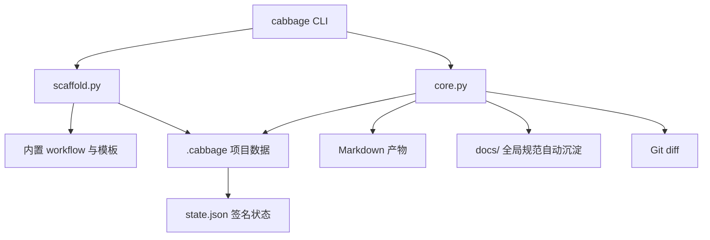

# 架构说明

Cabbage 采用单进程、文件系统驱动的 CLI 架构。工作流定义、变更规格、Markdown 产物和签名状态共同构成事实来源，不依赖数据库或远程服务。

## 模块职责

| 模块 | 职责 |
| --- | --- |
| `cabbage_cli/cli.py` | 命令解析、输出格式和退出码；连接用户操作与领域函数 |
| `cabbage_cli/core.py` | 配置读取、阶段计算、签名、Markdown 校验、门禁、Git diff 与 CI 规则 |
| `cabbage_cli/scaffold.py` | 初始化项目、复制内置资源、创建变更、渲染模板和同步影响矩阵 |
| `cabbage_cli/assets/workflows/` | 八类变更的阶段、依赖、条件和文档契约 |
| `cabbage_cli/assets/templates/` | 变更产物模板及完成态占位标记 |

## 运行流程

`cabbage init` 将工作流复制到 `.cabbage/workflows/`，并默认把 `cabbage_cli` vendoring 到 `.cabbage/tooling/`。因此 CI 可以直接使用仓库内工具版本，而不依赖预先发布的 Python 包。

本仓库的唯一 CLI 源码是 `cabbage_cli/`。修改后执行 `python scripts/sync-vendor.py`
生成 `.cabbage/tooling/cabbage_cli/`，不要手改副本；该命令不更新项目工作流、配置或历史记录。
`python -m unittest discover -s tests -p test_repository_contracts.py` 检查副本内容（含隐藏站点配置）
与指南阶段名称，完整测试套件及 CI 同样执行这些检查。已有项目不要用 `init --force` 升级 CLI，
因为它会覆盖项目配置及工作流。

## 数据与目录模型

每个活跃变更位于 `.cabbage/changes/<change-id>/`：

- `change.yaml`：变更 ID、类型、状态和十项影响字段。
- Markdown 产物：由所选 workflow 的阶段定义决定。
- `state.json`：已完成阶段的签名和完成时间，由 CLI 写入。

项目级配置位于 `.cabbage/config.yaml`；工作流位于 `.cabbage/workflows/`；完成全部阶段的变更移动到 `.cabbage/archive/<year>/`。

## 说明书分发

面向 agent 的操作说明是 `skills/` 下的五个场景 skill：`cabbage-change`（流程入口）、
`cabbage-decision`、`cabbage-incident`、`cabbage-docs`、`cabbage-adopt`。
每个 skill 自包含其最小闭环与所需 references，可单独安装。根目录不再提供 `SKILL.md` 与 `references/`。

拆分依据是 skill 触发依赖 description 语义匹配：按任务场景拆分使单次任务只加载一个 skill，
而按流程阶段拆分会导致同一任务重复加载状态机知识。阶段真相保持在项目内
（`.cabbage/workflows/*.yaml` 与 `cabbage next`），skill 不复制工作流定义。

契约测试会校验每个 skill 的结构与相对链接，并阻止旧单文件入口回归。

## 新项目轻量工作流

内置 `feature / bugfix / refactor` 默认用 `change-record.md` 模板生成单份 `tasks.md`。
架构、API、数据库、安全和高风险发布阶段按现有影响字段启用，排列在 `implementation` 之前，
实现阶段依赖所有这些可选阶段；复用原有门禁和失效传播，不引入第二套状态机。

新工作流声明 `record_covers: [product, testing]`，CI 不再为这两项要求重复的当前文档改动。
其他影响目录规则不变。记录归档后仍保留在历史中，不额外添加实现阶段的同步映射。

新默认仅用于初始化。仓库自身 `.cabbage/workflows/` 及既有项目继续使用原有流程；
旧流程通过冻结的测试 fixture 验证兼容性，不因测试新默认而丢弃旧行为覆盖。

## 状态与签名

阶段签名由以下内容的 SHA-256 摘要组成：

- 当前 workflow 文件内容；
- 阶段定义及其条件上下文；
- 当前阶段产物内容；
- 所有已启用依赖阶段的递归签名。

已记录签名与当前签名一致时阶段为 `done`；任一输入变化后阶段为 `stale`。该机制让上游需求或设计变更自然传播到下游测试与实现阶段。

## 文档质量门禁

验证阶段（`verify`）时，核心校验器检查：

- 产物存在，且 frontmatter 中的 `change` 和 `cabbage_stage` 正确；
- workflow 声明的必需标题存在；
- 正文不含 `TODO`、`TBD`、`FIXME`、`CABBAGE` 提示或兼容的旧模板占位内容；
- 本地 Markdown 链接不越出项目根目录且目标存在；
- Mermaid 代码围栏闭合；
- `implementation` 清单存在且没有未勾选任务。

`sync` 按映射复制已启用且存在的产物，不检查验证状态或合并文档语义；发布前应先通过合并门禁。
`archive` 会先检查阶段门禁再同步和归档，但不检查 Git 合并状态。

## 门禁边界

- `implementation` 检查实现阶段之前的所有已启用阶段。
- `merge` 和 `archive` 检查全部已启用阶段。
- `ci` 在 Git diff 基础上检查代码变更是否绑定活跃变更，并按影响范围要求更新相应当前状态文档。

核心运行依赖仅为 Python 3.10+ 与 PyYAML。VitePress、Mermaid、Node.js 和 pnpm 只服务于文档站点预览与构建，不进入 CLI 的核心执行路径。
