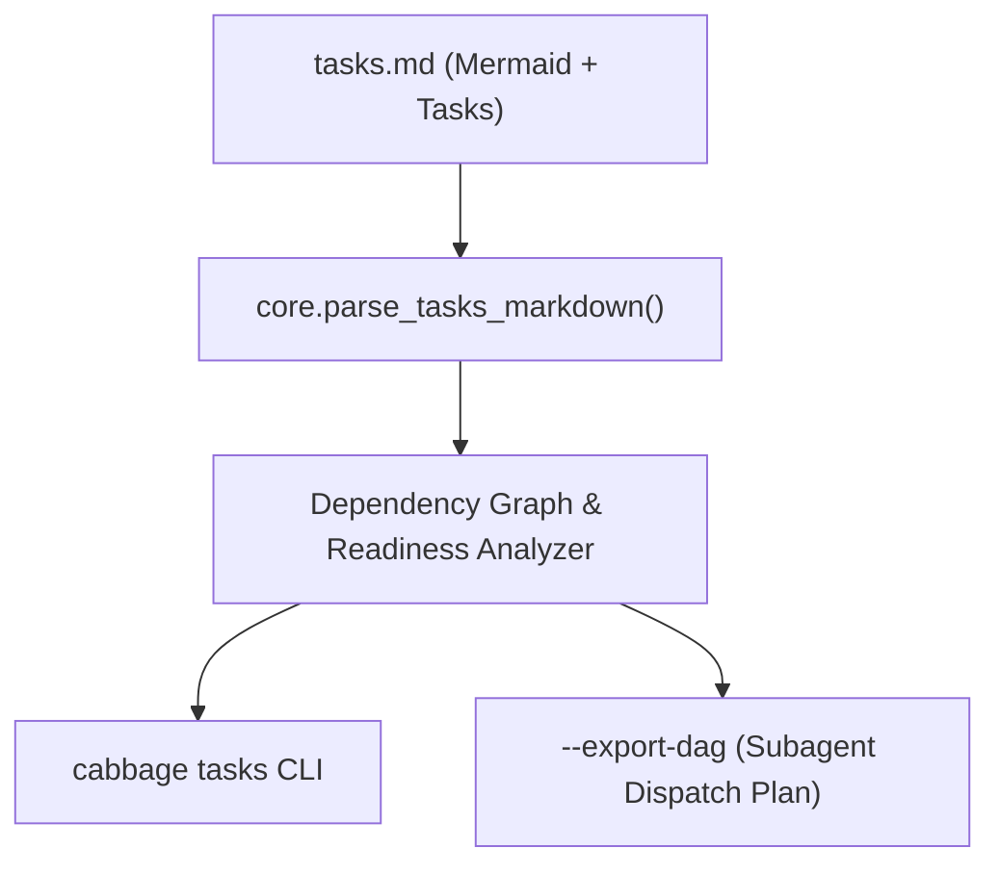

# Context

## Current State

Previously, Cabbage lacked formal pre-flight requirements grilling, forcing users and AI agents to guess boundary details. Tasks in `tasks.md` had no unified execution protocol (SOP), and CLI had no built-in DAG parser to export machine-readable dispatch plans for parallel subagents.

## Goals and Non-goals

- Goal: Provide end-to-end task DAG topology extraction, subagent dispatch plan generation, multi-proposal architecture comparison, and 4-step Task SOP.
- Non-goal: Interactive graphical UI in VitePress or background execution daemon.

# Requirements

| ID | Technical requirement | Source |
|---|---|---|
| TR-1 | Extract Mermaid `flowchart TD` edges and task blocks from `tasks.md`. | PRD R-1 |
| TR-2 | Compute task readiness based on completed prerequisites. | PRD R-1 |
| TR-3 | Generate structured parallel dispatch payloads with prompts and SOP steps. | PRD R-2 |

# Design

## Overview

The system parses `tasks.md` using robust regular expressions to extract Mermaid diagram edges, task sections (`## Task <slug>`), dependencies (`Blocked By`), parallel groups (`Parallel Group`), verification commands, and checklist statuses.

## Interfaces and Data

- `parse_tasks_markdown(text: str) -> dict`: Parses raw markdown into structured DAG metadata, task objects, and subagent dispatch plans.
- `get_change_tasks_dag(root: Path, change_id: str) -> dict`: Resolves file path and provides change-scoped DAG state.

## Decision Boundaries

### AI Autonomous Decisions
- Regular expression parsing tokens, string normalization, and terminal formatting.
- Unit test mock data and assertion structures.

### Human Gate Decisions
- CLI command arguments and public flags (`--export-dag`, `--json`).
- Schema structure of the exported subagent dispatch plan.

# Alternatives

## Architecture Options Comparison

| Option | Architecture Approach | Benefits | Costs & Risks | Recommendation |
|---|---|---|---|---|
| Option A (Recommended) | In-process regex-based parser inside `core.py` with CLI integration | Zero new dependencies, fast (<5ms), robust fallback for flat lists | Requires careful regex maintenance for varied markdown styles | Chosen |
| Option B (Alternative) | Heavyweight CommonMark AST parser dependency | Strict AST representation | Introduces third-party dependency violating zero-dependency rule | Rejected |

## Selected Decision & Trade-off Rationale

Option A was chosen because Cabbage prioritizes zero external dependencies and high performance. The parser includes a defensive fallback to standard checklists when structured task headers are absent.

# Security and Privacy

N/A. CLI operates exclusively on local workspace files within the project root.

# Observability

| Signal | Purpose | Alert or dashboard |
|---|---|---|
| CLI Exit Codes | Signals command success (0) or error (2) | CI pipeline logs and terminal output |

# Failure Modes

| Failure mode | Detection | Handling | Recovery |
|---|---|---|---|
| Malformed `tasks.md` missing headings | Parser regex mismatch | Falls back to scanning raw checkbox list under `# Tasks` | Ensures execution continues gracefully |

# Rollout

Standard release with vendored CLI updates in `.cabbage/tooling/cabbage_cli/`.

# Rollback

Revert commit or discard change without affecting existing active changes.

# Open Questions

- N/A
