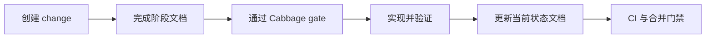

# Cabbage Documentation

这里记录 Cabbage 当前可观察的产品能力、架构、测试、CI/CD 与发布方式。
变更过程保存在 `.cabbage/changes/`，当前状态以本站内容为准。

```mermaid
flowchart LR
    Change[创建 change] --> Artifacts[完成阶段文档]
    Artifacts --> Gate[通过 Cabbage gate]
    Gate --> Implement[实现并验证]
    Implement --> Current[更新当前状态文档]
    Current --> CI[CI 与合并门禁]
```
