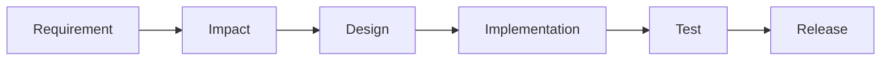

# Diagrams

Mermaid is the default text diagram format.

```mermaid
flowchart LR
    Requirement --> Impact
    Impact --> Design
    Design --> Implementation
    Implementation --> Test
    Test --> Release
```

Use external drawing tools only when Mermaid cannot express the information clearly. Keep source files alongside the exported asset.
