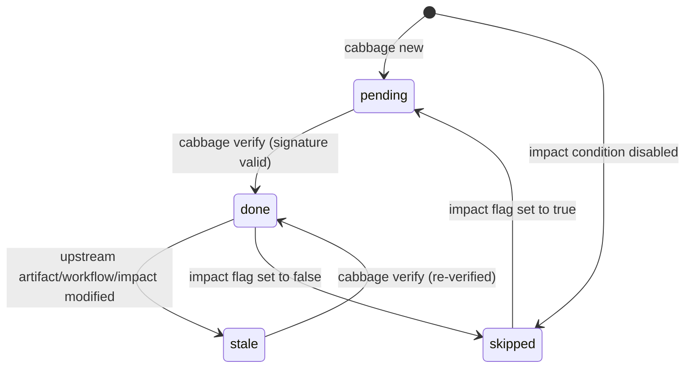

# Change & Artifact Lifecycle Management

This document details the lifecycle stages, state transitions, cryptographic signatures, cascading invalidation, and persistent synchronization in Cabbage.

---

## 1. Change Lifecycle States

A change progresses through two top-level states:

```text
[ active ] ─── (implementation & verification) ───► [ gate: archive ] ───► [ archived ]
```

- **Active**: Workspace located at `.cabbage/changes/<change-id>/`. Work is actively planned, designed, implemented, and verified.
- **Archived**: Workspace moved to `.cabbage/archive/<YYYY>/<change-id>/`. The CLI treats the change as closed and synchronizes mapped artifacts into `docs/`. Files remain ordinary Git-managed files; immutability depends on repository policy.

---

## 2. Stage State Machine

New projects use a single `implementation` stage backed by `tasks.md` for ordinary
features, fixes, and refactors. Risk flags enable specialist stages before it;
without those flags the implementation gate has no prerequisites. The merge gate
still requires the completed and verified record. Existing project workflows are
not migrated. The record is retained in the archive, not copied into product and
testing directories.

Each workflow stage inside a change has one of four derived states:



### Stage State Definitions

| State | Meaning | Trigger / Resolution |
|---|---|---|
| `pending` | Artifact created from template, not yet verified | Fill in artifact content, remove placeholders, and run `cabbage verify` |
| `done` | Artifact verified; SHA-256 signature and dependency signatures match | Stable state; ready for downstream stages or gate checks |
| `stale` | Previously verified, but invalidated due to upstream changes | Re-review artifact in light of upstream changes, then run `cabbage verify` |
| `skipped` | Deactivated by the impact analysis matrix | Controlled via `cabbage impact <change> --set <field>=false` |

---

## 3. Cryptographic Signature & Cascading Invalidation (Anti-Rot)

To prevent documentation from rotting or going out of sync with code and design:

1. **Content Signature**: When `cabbage verify <change> <stage>` runs, Cabbage computes the SHA-256 hash of the artifact content, the workflow stage schema, and all upstream dependency signatures.
2. **Recorded in `state.json`**: The signature is saved into `.cabbage/changes/<change-id>/state.json`.
3. **Cascading Invalidation**: If an upstream stage artifact is edited:
   - The upstream stage's hash changes.
   - All dependent downstream stages automatically evaluate to `stale`.
   - Gate checks (`gate implementation`, `gate merge`) will block until the stale stages are re-verified.

---

## 4. Specification Synchronization (`cabbage sync`)

Specifications produced during a change are synchronized into persistent, long-lived documentation:

- **Sync Targets**:
  - `api-design.md` -> `docs/05-api/`
  - `database-design.md` -> `docs/04-domain/`
  - `adr.md` -> `docs/03-architecture/adr/`
  - `rfc.md` -> `docs/03-architecture/rfc/`
- **When to Sync**:
  - Before pull request merge (`cabbage sync <change>`)
  - Automatically executed during `cabbage archive <change>`

---

## 5. Gate Enforcement Milestones

| Gate Target | Enforced Conditions | Next Permitted Action |
|---|---|---|
| `cabbage gate <change> implementation` | All enabled stages before `implementation` in the workflow are `done` | Begin implementation |
| `cabbage gate <change> merge` | All enabled stages are `done`, no `stale` stages | Request merge |
| `cabbage gate <change> archive` | Same stage checks as `merge`; Git merge status is not inspected | Archive after independently confirming merge |

Stage IDs are not artifact filenames. New lightweight workflows use `adr`, `api`,
`database`, `security`, `release` and `implementation`; older or specialist
workflows may use `requirement`, `impact`, `design` and `tests`. Always consult
`cabbage next <change-id>` for the current project's actual stages instead of
guessing or reusing another project's names.

Standalone `sync` copies mapped artifacts without a gate check. Run `gate merge`
first when publishing final documents. It does not combine successive change
records into a module's current specification.
